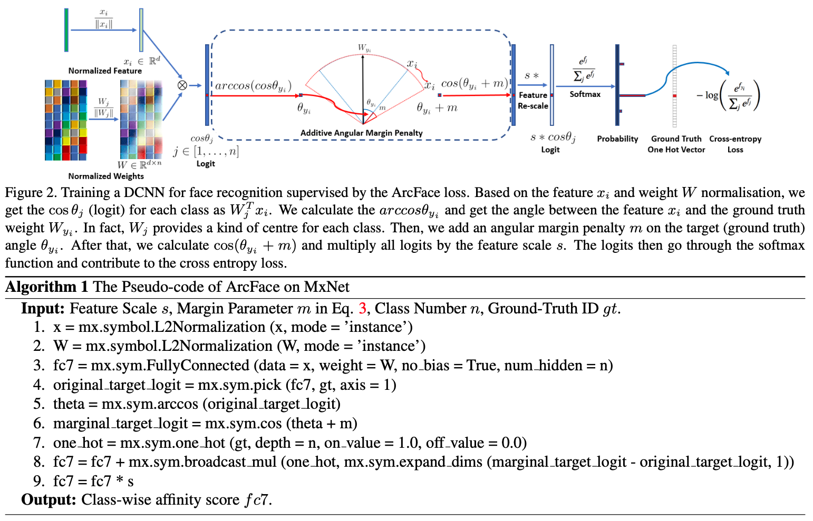

[TensorFlow 2] ArcFace: Additive Angular Margin Loss for Deep Face Recognition
=====

## Related Repositories
<a href="https://github.com/YeongHyeon/ResNet-TF2">ResNeXt-TF2</a>  

## Concept
<div align="center">
    
  <p>Concept and Pseudo-code of ArcFace [1].</p>
</div>

## Performance

|Indicator|Value|
|:---|:---:|
|Accuracy|0.-----|
|Precision|0.-----|
|Recall|0.-----|
|F1-Score|0.-----|

```
Confusion Matrix
```

## Requirements
* Python 3.7.6  
* Tensorflow 2.1.0  
* Numpy 1.18.1  
* Matplotlib 3.1.3  

## Reference
[1] Jiankang Deng et al. (2018). <a href="https://arxiv.org/abs/1801.07698">ArcFace: Additive Angular Margin Loss for Deep Face Recognition</a>. arXiv preprint arXiv:1801.07698.
