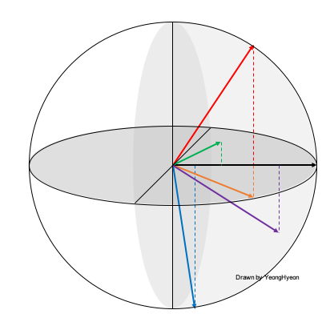

[TensorFlow 2] ArcFace: Additive Angular Margin Loss for Deep Face Recognition
=====

## Related Repositories
<a href="https://github.com/YeongHyeon/ResNet-TF2">ResNet-TF2</a>  

## Concept
<div align="center">
    
  <p>Concept and Pseudo-code of ArcFace [1].</p>
</div>
<div align="center">
  <p></p>
  <p></p>   
</div>

## Performance

|Indicator|Value|
|:---|:---:|
|Accuracy|0.99490|
|Precision|0.99482|
|Recall|0.99486|
|F1-Score|0.99483|

```
Confusion Matrix
[[ 978    0    0    0    0    0    0    2    0    0]
 [   0 1132    1    1    0    0    0    1    0    0]
 [   0    0 1031    0    0    0    0    1    0    0]
 [   1    0    1 1000    0    6    0    1    1    0]
 [   0    0    1    0  978    0    0    0    0    3]
 [   1    0    0    2    0  888    1    0    0    0]
 [   5    2    0    0    0    0  951    0    0    0]
 [   0    0    1    0    0    0    1 1024    1    1]
 [   3    0    0    2    0    0    1    0  967    1]
 [   0    0    0    0    7    2    0    0    0 1000]]
Class-0 | Precision: 0.98988, Recall: 0.99796, F1-Score: 0.99390
Class-1 | Precision: 0.99824, Recall: 0.99736, F1-Score: 0.99780
Class-2 | Precision: 0.99614, Recall: 0.99903, F1-Score: 0.99758
Class-3 | Precision: 0.99502, Recall: 0.99010, F1-Score: 0.99256
Class-4 | Precision: 0.99289, Recall: 0.99593, F1-Score: 0.99441
Class-5 | Precision: 0.99107, Recall: 0.99552, F1-Score: 0.99329
Class-6 | Precision: 0.99686, Recall: 0.99269, F1-Score: 0.99477
Class-7 | Precision: 0.99514, Recall: 0.99611, F1-Score: 0.99562
Class-8 | Precision: 0.99794, Recall: 0.99281, F1-Score: 0.99537
Class-9 | Precision: 0.99502, Recall: 0.99108, F1-Score: 0.99305

Total | Accuracy: 0.99490, Precision: 0.99482, Recall: 0.99486, F1-Score: 0.99483
```

## Requirements
* Python 3.7.6  
* Tensorflow 2.1.0  
* Numpy 1.18.1  
* Matplotlib 3.1.3  

## Reference
[1] Jiankang Deng et al. (2018). <a href="https://arxiv.org/abs/1801.07698">ArcFace: Additive Angular Margin Loss for Deep Face Recognition</a>. arXiv preprint arXiv:1801.07698.
